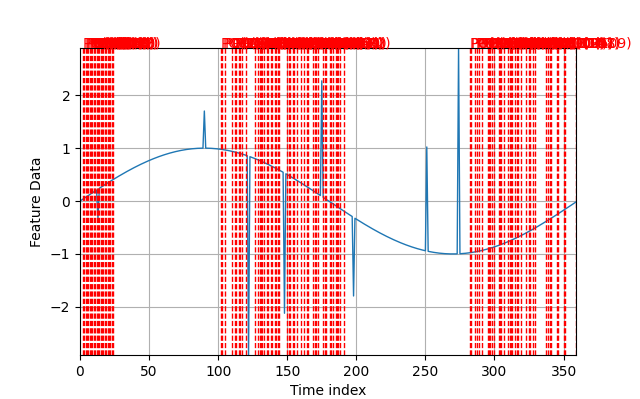

.. _Howto_OA_AD_001:
Howto OA-AD-001: Anomaly Detection using a One Class SVM (1D)
=============================================================

**Executable code**

.. literalinclude:: ../../../../../test/howtos/oa/howto_oa_ad_001_oneclasssvm_pa_1d.py
	:language: python

**Results**

**Cross reference**
    - :ref:`API Reference: Wrapper for scikit-learn Anomaly Detectors <api_ad>`
