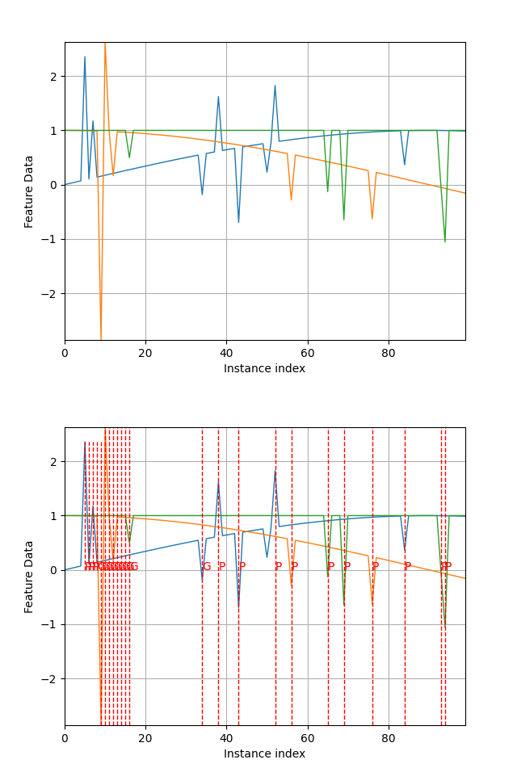

.. _Howto_OA_AD_002:
Howto OA-AD-002: Anomaly Detection using Local Outlier Factor
======================================================

**Executable code**

.. literalinclude:: ../../../../../test/howtos/oa/howto_oa_ad_002_anomalydetector_lof.py
	:language: python

**Results**

**Cross Reference**
    - :ref:`API Reference: Wrappers for scikit-learn Anomaly Detectors <api_ad>`
