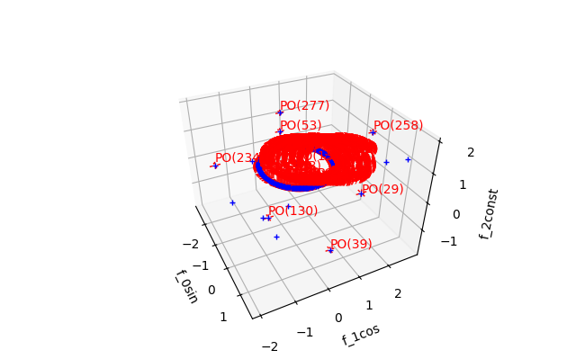

.. _Howto_OA_AD_003:
Howto OA-AD-003: Anomaly Detection using a One Class SVM (3D)
=============================================================

**Executable code**

.. literalinclude:: ../../../../../test/howtos/oa/howto_oa_ad_003_oneclasssvm_pa_3d.py
	:language: python

**Results**

**Cross Reference**
    - :ref:`API Reference: Wrappers for scikit-learn Anomaly Detectors <api_ad>`
