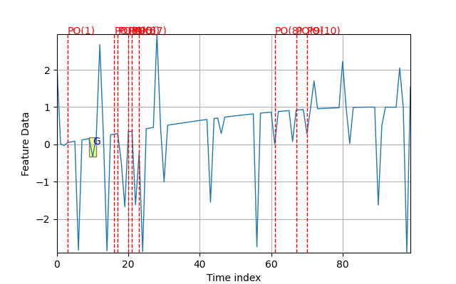

.. _Howto_OA_AD_005:
Howto OA-AD-005: Extended Anomaly Detection using a One Class SVM (1D)
=============================================================

**Executable code**

.. literalinclude:: ../../../../../test/howtos/oa/howto_oa_ad_005_oneclasssvm_paga_1d.py
	:language: python

**Results**

**Cross Reference**
    - :ref:`API Reference: Wrappers for scikit-learn Anomaly Detectors <api_ad>`
