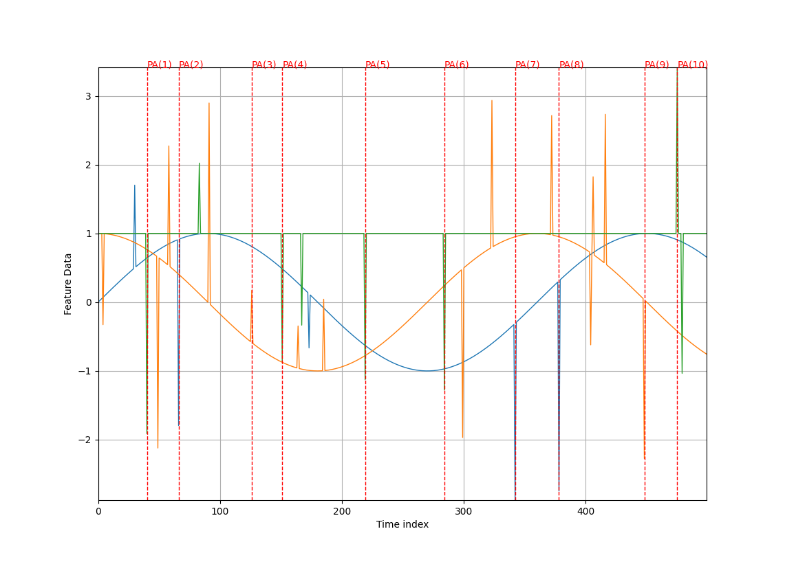

.. _Howto_OA_AD_014:
Howto OA-AD-014: Anomaly Detection using Local Outlier Factor (nD)
==================================================================

**Executable code**

.. literalinclude:: ../../../../../test/howtos/oa/howto_oa_ad_014_lof_pa_nd.py
	:language: python

**Results**

**Cross reference**
    - :ref:`API Reference: Wrapper for scikit-learn Anomaly Detectors <api_ad>`
