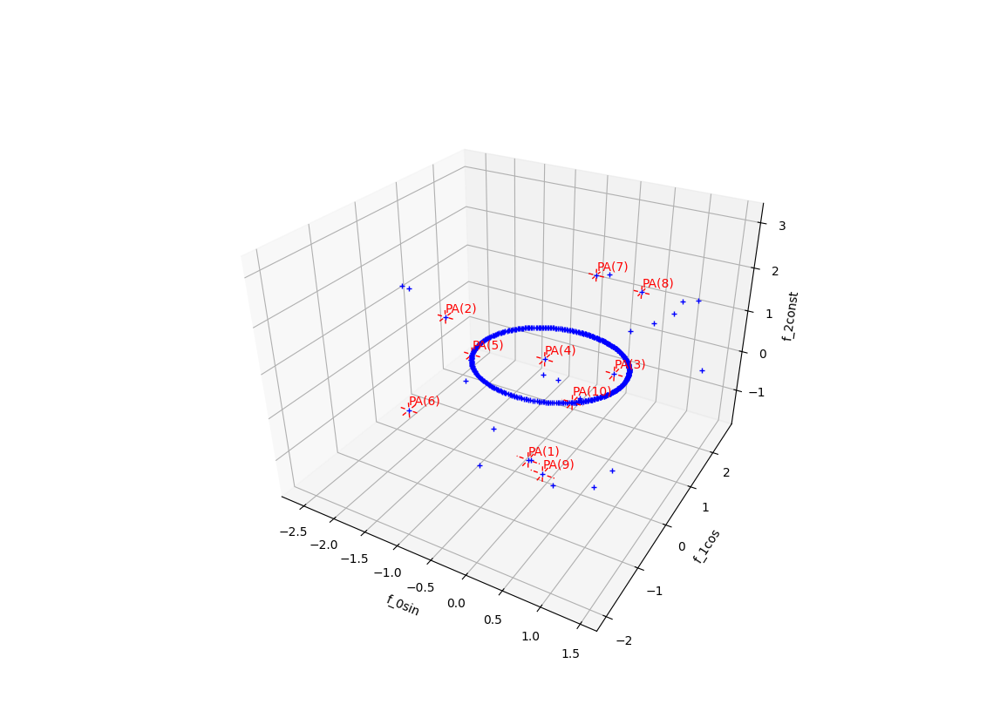

.. _Howto_OA_AD_023:
Howto OA-AD-023: Anomaly Detection using Elliptic Envelope (3D)
===============================================================

**Executable code**

.. literalinclude:: ../../../../../test/howtos/oa/howto_oa_ad_023_ee_pa_3d.py
	:language: python

**Results**

**Cross reference**
    - :ref:`API Reference: Wrapper for scikit-learn Anomaly Detectors <api_ad>`
