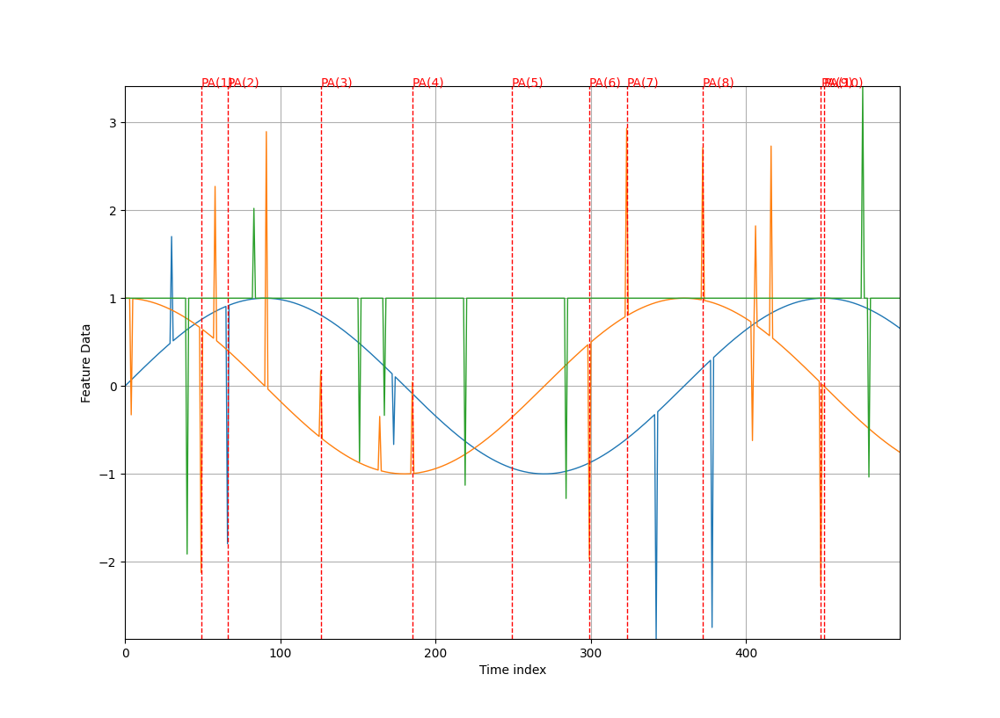

.. _Howto_OA_AD_024:
Howto OA-AD-024: Anomaly Detection using Elliptic Envelope (nD)
===============================================================

**Executable code**

.. literalinclude:: ../../../../../test/howtos/oa/howto_oa_ad_024_ee_pa_nd.py
	:language: python

**Results**

**Cross reference**
    - :ref:`API Reference: Wrapper for scikit-learn Anomaly Detectors <api_ad>`
