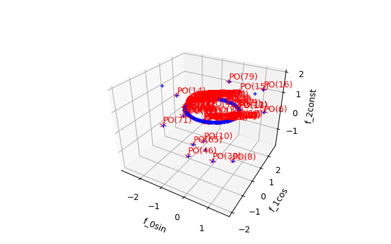

.. _Howto_OA_AD_043:
Howto OA-AD-043: Anomaly Detection using Isolation Forest (3D)
==================================================================

**Executable code**

.. literalinclude:: ../../../../../test/howtos/oa/howto_oa_ad_043_if_pa_3d.py
	:language: python

**Results**

**Cross reference**
    - :ref:`API Reference: Wrapper for scikit-learn Anomaly Detectors <api_ad>`
