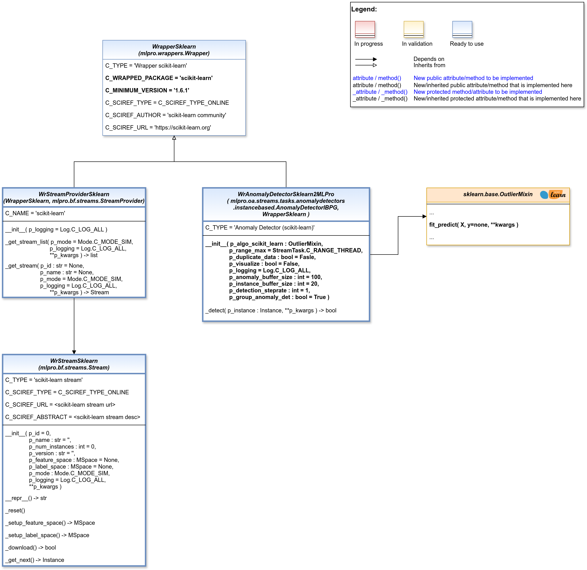

.. _api_basics:
Wrapper classes
===============

.. automodule:: mlpro_int_sklearn.wrappers.basics
    :members:
    :undoc-members:
    :private-members:
    :show-inheritance:
  

.. _api_streams:
Wrappers for data streams
-------------------------

  .. automodule:: mlpro_int_sklearn.wrappers.streams
    :members:
    :undoc-members:
    :private-members:
    :show-inheritance:

.. _api_ad:
Wrapper for anomaly detectors
-----------------------------

  .. automodule:: mlpro_int_sklearn.wrappers.anomalydetectors.basics
    :members:
    :undoc-members:
    :private-members:
    :show-inheritance: